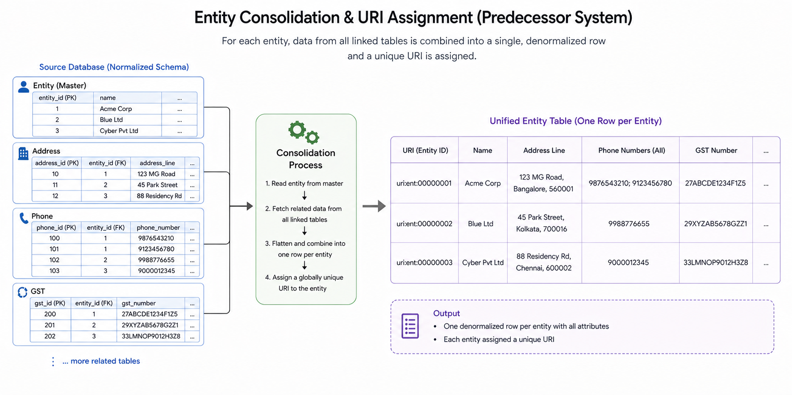
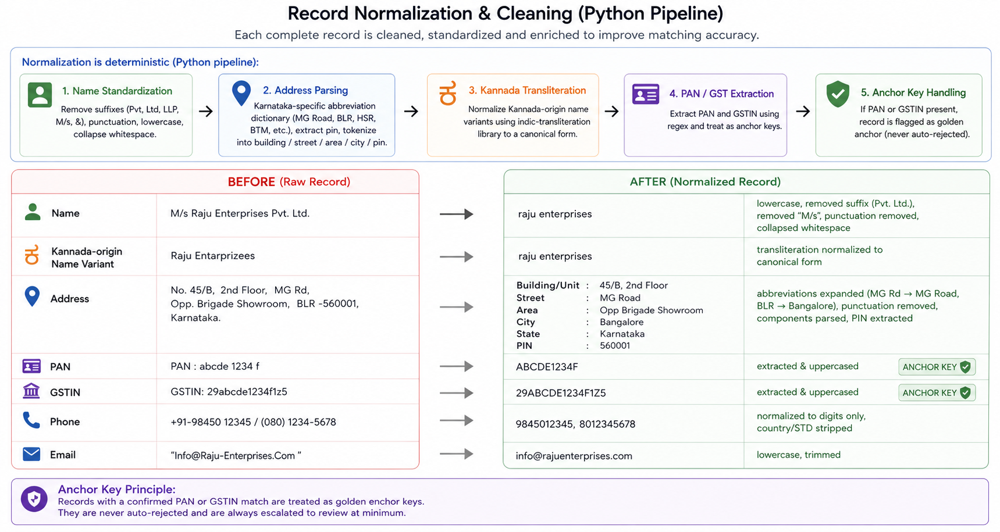
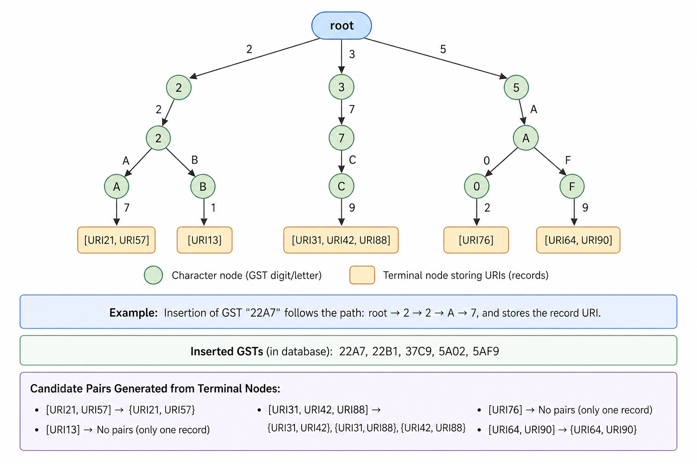
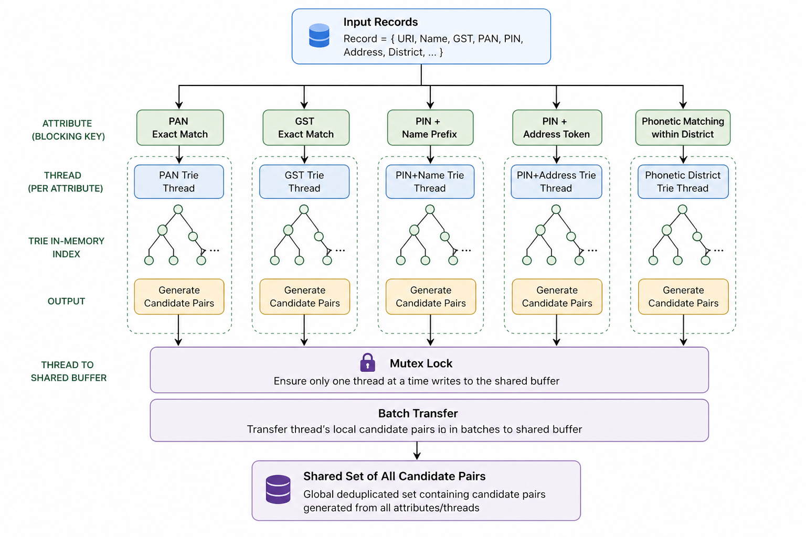

# ai-for-bharat-team-AJAY-theme-1
Team AJAY's proposal for AI For Bharat Hackathon for Theme 1 : UBID and Business Intelligence.

# **KA-UBID: Self-Learning Entity Resolution and Active Business Intelligence Across Karnataka’s Siloed Systems**

---

## **1\. The Problem (Precisely Defined)**

Karnataka does not have a data shortage. It has an **identity problem**.

\~3.5 million businesses interact with 40+ department systems \-  Shop Establishment, Labour, BESCOM, BWSSB, Factories, Food Safety, Fire, etc. Each system was built independently. Each stores business names and addresses as **unstructured free text with no shared identifier**.

The same business appears as multiple records:

* “M/s Raju Enterprises Pvt. Ltd.”  
* “raju enterprises”  
* “RAJU ENT”

There is **no reliable join key**.

As a result:

* Cross-department aggregation is impossible  
* Compliance gaps remain invisible  
* Even simple queries fail

Example:  
“Active factories in pin code 560058 not inspected in 18 months” , cannot be answered today, even though data exists.

This is not a data problem. It is a **record linkage \+ identity resolution failure**.

---

## **2\. What We Are Building**

A **two-part platform** that runs alongside existing systems (no migration, no disruption):

### **Part A \-  UBID Assignment**

* Links records across departments referring to the same business  
* Assigns a **Unique Business Identifier (UBID)**  
* Every linkage is explainable  
* Ambiguous cases go to human review (never auto-merged blindly)

### **Part B \-  Active Business Intelligence**

* Aggregates events (inspection, renewal, consumption, compliance)  
* Infers **Active / Dormant / Closed** status per business  
* Produces a **fully auditable evidence timeline**

---

# **3\. End-to-End Execution Flow**

**Summary Flow:**

1. Department systems export data (CSV/API)  
2. Records are normalized (names, addresses, identifiers)  
3. Candidate matches are generated via blocking  
4. Probabilistic scoring (Splink) assigns match likelihood  
5. Decision routing:  
   * Auto-link  
   * Human review  
   * Reject  
6. UBID is assigned  
7. Events are ingested and mapped to UBID  
8. Classification engine derives business status  
9. DuckDB enables analytical queries

### **Key Guarantees:**

* No source system modification (read-only ingestion)  
* Fully explainable matching (no black box)  
* Human-in-the-loop improves system over time

---

# **4\. Part A \-  Entity Resolution** 

# **4.1 Ingestion & Normalization**

We assume **Day 1 reality**:

* Most departments do NOT have APIs  
* CSV/Excel exports are the primary ingestion mechanism

First, we perform flattening of each record that is available to us, such that every piece of information is captured within the same “row” or “record”.

Normalization is deterministic (Python pipeline):

* Name standardization (remove suffixes, punctuation, convert text to lowercase)  
* Dictionary-Based Transformation Layer (using localised lookup tables to expand shorthands. Eg: translating “BLR” to “Bengaluru”).  
* Address parsing (pin, street, area)  
* Kannada transliteration normalization  
* PAN/GST extraction (treated as anchor keys)

**Why not LLMs?** Non-deterministic \+ PII risk.

---

## **4.2 Blocking (Scaling Problem)**

Naive matching \= **O(n²)** which is  infeasible.

We reduce search space using Trie based blocking with following attributes:

* PAN/GST exact match  
* Pin \+ name prefix  
* Pin \+ address token  
* Phonetic matching within district

Custom Trie index achieves **O(m ) lookup**

The Tries will follow a simple format : 

- Each node will represent the character of the attribute being inserted into the trie.  
- The ending node for each entry will contain a list of URIs, representing the records with that attribute value.   
- For each list with multiple URIs, all possible pairs are generated, serving as candidate pairs

An illustration of Trie using sample shortened values for GST.

Each blocking key will have its own trie. To process all attributes of a record in parallel, we will use a multi threaded trie generation system with a mutex lock for safely collecting all candidate pairs in a shared data structure.

---

## **4.3 Scoring (Probabilistic Matching)**

We use **Splink (EM-based probabilistic linkage)**.

Why:

* No labeled data required  
* Learns from raw data  
* Produces explainable scores (Bayes factors)

Features:

* PAN/GST match (highest weight)  
* Name similarity (RapidFuzz)  
* Address similarity  
* Pin match  
* Phone match  
* Interactive reviewal interface 

---

## **4.4 Decision Routing**

| Score | Action |
| :---: | :---: |
| ≥ 0.90 | Auto-Link |
| 0.50–0.89 | Human Review |
| \< 0.50 | Reject |

Design principle: **False positives are 3× more costly than false negatives.**

---

# **5\. Human-in-the-Loop (Core Differentiator)**

Unlike typical systems, reviewer decisions are not terminal.

We track:

* Override rates  
* Inter-reviewer consistency  
* Precision-recall evolution

The system automatically recalibrates thresholds.

**Effect:**  
Review load reduces over time (self-improving system).

**Features of the Reviewer Dashboard**

The Reviewer Dashboard is designed to transform complex probabilistic math into an intuitive, visual decision engine through the following features:

1. Display raw and normalized data side-by-side, automatically highlighting identical fields in green and mismatches in red to eliminate visual hunting.

2. Embed a visual Bayes Factor chart directly in the task view to clearly explain the AI's reasoning, removing reviewer guesswork and mental fatigue.

3. Provide three clear, one-click action buttons (Merge, Separate, Escalate) to streamline conflict resolution and prevent decision paralysis.

4. Automate all audit logging (timestamp, reviewer ID, algorithm version) in the background so the reviewer experiences zero manual data-entry overhead.

---

# **6\. Part B \-  Active Business Intelligence**

## **6.1 Event Model**

Each event is normalized as:

* UBID  
* Event type (Inspection / Renewal / Consumption / etc.)  
* Timestamp  
* Signal weight

Unmatched events are **never dropped** → sent to the review queue.

---

## **6.2 Classification Engine**

Rule-based (not ML, by design):

| Status | Criteria |
| :---: | :---: |
| Active | ≥1 HIGH or ≥2 MEDIUM events in 180 days |
| Dormant | No events for 6–18 months |
| Closed | Closure signal OR inactivity \>18 months |

Signal weights:

* HIGH → electricity/water usage  
* MEDIUM → renewal, compliance  
* LOW → minor updates

---

## **6.3 Output Example**

UBID: KA-UBID-00123  
Status: ACTIVE

Evidence:  
\- Electricity consumption (HIGH)  
\- License renewal (MED)  
\- Compliance filing (MED)

---

# **7\. Data Flow: Part A to Part B**

UBID converts fragmented records into a **time-series identity layer**.

---

# **8\. System Architecture**

Key properties:

* Runs on **on-prem infrastructure**  
* No vendor lock-in  
* Handles millions of records  
* Sub-second analytics via DuckDB

---

# **9\. Design Decisions We Rejected**

* LLM-based matching → non-deterministic \+ unsafe for PII  
* Full data migration → politically infeasible  
* Pure SQL matching → insufficient for fuzzy logic  
* Fully automated linking → unacceptable risk

---

# **10\. What Breaks This System**

| Risk | Mitigation |
| :---: | :---: |
| Poor data quality | Multi-key blocking \+ normalization |
| Wrong merge | Conservative thresholds \+ audit \+ undo |
| Reviewer bottleneck | Batch UI \+ auto-link majority |
| Missing identifiers | Probabilistic matching |
| Multi-PAN edge cases | Mandatory escalation |

---

# **11\. Example Walkthrough**

| BEFORE | AFTER |
| :---: | :---: |
| Factories → "RAJU ENTERPRISES PVT LTD" Labour → "Raju Ent" BESCOM → "RAJU ENTERPRISES"  | UBID: KA-UBID-00123 Status: ACTIVE |

This is the transformation: **disconnected records TO unified business identity**

---

# **12\. Technology Stack**

| Layer | Technology | Why |
| ----- | ----- | ----- |
| Normalization | Python \+ RapidFuzz \+ indic-transliteration | Deterministic, fast, open-source |
| Blocking | Custom Trie \+ Splink blocking rules | O(m) lookup, auditable |
| Scoring | Splink (EM algorithm) | Unsupervised, explainable Bayes factors, production-proven |
| Analytics DB | DuckDB | Zero-infrastructure embedded OLAP, sub-second on millions of rows |
| Event streaming | Apache Kafka  | Reliable, replayable, handles at-least-once delivery |
| UBID Registry | PostgreSQL | ACID-compliant, strong consistency for identity data |
| Reviewer UI | React \+ REST API | Fast to build, accessible on any government browser |
| NL Query Layer | LLM on scrambled schema only | Plain-English access for non-technical staff |
| Synthetic Data | Faker \+ custom Karnataka locale | Realistic test data without real PII |

# **13\. Deployment Strategy**

* Start with 2 departments (Factories \+ Shops)  
* Use file exports (no API dependency)  
* Demonstrate measurable value  
* Expand incrementally